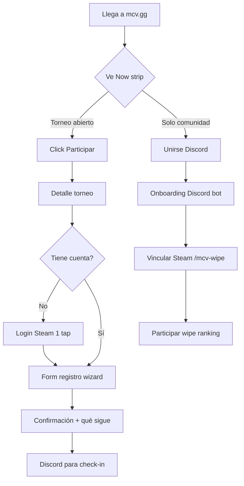

# MCV OFICIAL 3.0 — Masterplan UX/UI + Product Design

**Documento:** Estrategia de rediseño completo  
**Perspectiva:** Producto de plataforma competitiva (referentes: Riot Client, FACEIT Hub, Steam Community, Discord Activity, Apple Human Interface)  
**Horizonte:** 5 años de evolución  
**Alcance:** Experiencia pública + miembros + staff — no parches sobre la web actual  

---

## Premisa estratégica

MCV no necesita “una web de clan más bonita”. Necesita **un hub competitivo** donde un jugador entienda en 5 segundos qué es el clan, qué pasa hoy, y cuál es su siguiente acción — igual que al abrir FACEIT ves tu match, tu elo y el botón Play, o al abrir Discord ves tus servidores y notificaciones.

La web 2.x acumuló funciones porque cada necesidad del clan generó una página. La 3.0 invierte el orden: **primero el recorrido**, después las features. Todo lo que no acelera “entrar → participar → ver resultados” se elimina, oculta o mueve fuera del camino principal.

**Regla rectora:** Menos opciones = mejor experiencia.

---

# 0. Diagnóstico — Qué pasa hoy (sin respetar la implementación)

## 0.1 Qué sobra (ruido, no valor)

| Elemento | Por qué sobra |
|----------|----------------|
| **7 ítems en navbar** para un usuario nuevo | Parálisis de elección; no hay jerarquía clara de “empieza acá” |
| **Home con 6+ secciones** (hero, stats, strip, features, media, values, CTA) | Responde “qué es MCV” en el párrafo 3, no en el segundo 1 |
| **Tracker en nav principal** | Herramienta de staff/reclutamiento, no de fan casual — pertenece a Reclutamiento o Staff |
| **Bot como nombre de nav** | Jargon interno; “Tracker” o nada en nav público |
| **Mi cuenta como ítem top-level** | Estado de sesión, no destino — va en avatar/menú usuario |
| **Footer duplicado + link Admin visible** | Rompe la ilusión de producto; admin es otro producto |
| **Strip decorativo “Red MCV · Torneos…”** | Motion sin información |
| **Auth float en home** | Compite con CTAs principales |
| **Páginas redirect** (`equipo.html`, `jugadores.html`) | Deuda legacy — redirects OK, pero no deben existir en mental model |
| **Vital Rust huérfana de nav** | Feature potente escondida; o va al hub miembro o no existe como página suelta |
| **Login hints de Google Console** | Contenido de dev en prod |
| **Textos mixtos EN/ES en torneo** | Producto sin localización unificada |
| **Admin = 6 tabs + Vital monolito** | Un solo “Control Room” para todo — deberían ser 2 productos: **Compete** (torneos) y **Ops** (wipe/Vital) |

## 0.2 Qué falta (expectativa de plataforma competitiva)

| Gap | Referente |
|-----|-----------|
| **Estado “ahora” unificado** | FACEIT: próximo match + live |
| **Hub de resultados** | Riot: esports schedule + standings en un click |
| **Perfil de jugador** | Steam: identidad + historial |
| **Calendario wipe/torneos** | Calendario esports LoL |
| **Bracket público** | Challonge/FACEIT bracket viewer |
| **Ranking wipe con contexto** | Leaderboard con delta, tier, wipe |
| **Onboarding guiado** | Discord: join server → verify → channels |
| **Notificaciones / actividad** | Discord activity feed |
| **Empty states con acción** | Apple: nunca una pantalla muerta |
| **Búsqueda global** | Steam: jugador, torneo, ticket |
| **Design system documentado** | Apple HIG / Riot design tokens |
| **Separación miembro vs público vs staff** | Steam: store vs community vs developer |

## 0.3 Qué probablemente nadie usa (hipótesis producto)

Basado en arquetipos de clan Rust + auditoría técnica:

| Feature | Uso estimado | Acción 3.0 |
|---------|--------------|------------|
| Solicitud perfil equipo (URL oculta) | Solo invitados staff | Mantener como link mágico, fuera de IA |
| Consulta ticket por ID | Bajo — la gente pregunta en Discord | Mantener pero secundario |
| Hall of Fame events | Medio — solo post-torneo | Integrar en Results hub |
| TikTok grid home | Bajo vs YouTube/Discord | Colapsar en “Media” |
| Valores/bento home | Bajo — scroll sin CTA | Eliminar o 1 línea en About |
| Auth float home | Muy bajo | Eliminar — login en avatar |
| Admin tab Perfiles equipo | Medio-bajo frecuencia | Fusionar con Equipo ops |
| Export Excel Vital | Alto staff, cero público | Solo Ops |
| Multiple CSS admin en vital-rust público | Nadie lo “usa” — carga invisible | Arquitectura, no feature |

## 0.4 Qué distrae

- Stats bar con 4 métricas sin jerarquía (¿cuál importa hoy?)
- Tres cards “Operaciones” que repiten nav
- Discord aparece 5+ veces en home
- Form torneo de 15 campos sin progreso
- Admin Vital con KPIs + sidebar + tabs + logs simultáneos
- Tracker con 4 tabs para usuario casual

## 0.5 Duplicaciones

| A | B | Resolución 3.0 |
|---|---|----------------|
| Torneos en nav + home paths + features | Un hub **Compete** |
| Discord en hero, footer, CTAs | Un CTA primario + link secundario footer |
| Cuenta + Tickets auth | Sesión única, tickets dentro de cuenta |
| Vital admin + vital-rust público | Misma data, vistas distintas por rol |
| Events list + tournament detail | Lista → detalle OK; añadir **Results** agregado |
| Wipe stats Discord + web | Web = fuente de verdad visual; Discord = notificaciones |

## 0.6 Qué ocultar (progressive disclosure)

- Tracker → Reclutamiento / Staff / link en perfil jugador
- Admin → subdominio `ops.mcv.gg` o `/ops` con login separado
- Solicitud roster → link invitación
- Config Vital tier tables → Ops avanzado
- BM manual URL → Ops tracker
- Turnstile/setup hints → solo dev env

## 0.7 Qué mover de página

| De | A |
|----|---|
| Streams | Home “Live now” widget + `/live` solo si hay broadcast |
| Ranking wipe | `/compete/standings` |
| Bracket | `/compete/tournaments/:slug/bracket` |
| Stats Vital miembros | `/member/stats` |
| Tickets crear | `/account/tickets/new` |
| Tracker | `/tools/scout` (no nav default) |

## 0.8 Qué eliminar completamente

- Nav item “Bot”
- Nav item “Mi cuenta” (→ avatar menu)
- Home strip decorativo
- Auth float
- Footer admin link público (staff bookmark)
- `admin-v2`, `events-core`, CSS backups (técnicos)
- Página live dedicada cuando offline (redirect a home live widget)
- Duplicar footer en HTML estático

---

# 1. HOME 3.0 — Diseño desde cero

## 1.1 Objetivo

Responder en **< 5 segundos**:

| Pregunta | Respuesta visual |
|----------|------------------|
| ¿Qué es MCV? | Una línea + logo: *Clan competitivo de Rust. Torneos, wipes, comunidad.* |
| ¿Qué está pasando ahora? | **Now strip** (1 bloque): torneo activo / wipe phase / stream live / próximo evento |
| ¿Cómo entro? | Botón primario **Unirse a Discord** |
| ¿Cómo participo? | Botón secundario **Ver torneos abiertos** o **Registrar equipo** si hay cupo |
| ¿Dónde veo resultados? | Link **Resultados y ranking** |
| ¿Dónde está Discord? | Mismo CTA primario + icono persistente bottom-right mobile |

## 1.2 Wireframe conceptual (mobile-first)

```
┌─────────────────────────────────┐
│ [Logo MCV]          [🔔] [Avatar]│  ← avatar = login/join
├─────────────────────────────────┤
│ NOW                             │
│ ┌─────────────────────────────┐ │
│ │ 🔴 LIVE · Torneo 2v2 Semanal│ │
│ │ Inscripciones cierran 6h    │ │
│ │ [Participar] [Ver bracket]  │ │
│ └─────────────────────────────┘ │
│                                 │
│ MCV · Clan competitivo Rust     │
│                                 │
│ [──── Unirse a Discord ────]    │  ← 56px, full width
│ [ Ver torneos ]                 │  ← ghost
│                                 │
│ RESULTADOS                      │
│ Top 3 wipe · Último campeón     │
│ [Ver ranking completo →]        │
│                                 │
│ EQUIPO · 12 activos             │
│ [Ver roster →]                  │
│                                 │
│ ─── optional: 1 video embed ─── │
└─────────────────────────────────┘
│ Compete │ Clan │ Live │ •••    │  ← bottom nav mobile
└─────────────────────────────────┘
```

## 1.3 Qué NO va en home

- Grid YouTube + TikTok (mover a `/media` o footer)
- 4 stat boxes iguales
- Tres feature cards que repiten nav
- Bloque “valores” / bento
- Tracker
- Vital stats
- Admin link

## 1.4 Estados del Now strip

1. **Torneo con inscripción abierta** → countdown + Participar  
2. **Torneo en curso** → Ver bracket + stream  
3. **Stream live** → Ver stream (Kick/Twitch)  
4. **Wipe week** → Fase wipe + link ranking horas/puntos  
5. **Off-season** → Próximo torneo + Discord  

Un solo bloque. Nunca más de una “prioridad 1”.

---

# 2. NAVEGACIÓN IDEAL

## 2.1 Público — 4 destinos + overflow

| Nav | Contenido | Por qué |
|-----|-----------|---------|
| **Compete** | Torneos, brackets, resultados, ranking wipe | Un solo mental model competitivo |
| **Clan** | Roster, about, media, Discord | Identidad + personas |
| **Live** | Solo visible si hay stream activo; si no, oculto | Evita página vacía |
| **••• More** | Scout (tracker), Media, Support | Progressive disclosure |

**Avatar (esquina):** Login → Account (tickets, mis torneos, stats si miembro)

## 2.2 Desktop top nav

```
MCV Logo    Compete    Clan    Live*    [Search ⌘K]    [Discord] [Avatar]
```
*Live = pill rojo solo si online

## 2.3 Mobile bottom nav

```
[ Compete ] [ Clan ] [ Live* ] [ Account ]
```
Live tab aparece/desaparece con animación cuando hay broadcast.

## 2.4 Staff (producto separado)

**ops.mcv.gg** o `/ops`

```
Ops
├── Compete Admin (torneos, brackets, inscripciones)
├── Roster Ops (wipe, horas, puntos, Vital)
├── Support (tickets)
└── Settings
```

Sin mezclar “generar bracket” con “recalcular puntos Vital” en la misma mente.

## 2.5 Por qué se elimina cada ítem actual

| Actual | Decisión | Razón |
|--------|----------|-------|
| Clan (index) | **Home** separado de Clan | Home = now; Clan = identidad |
| Torneos | **Compete** | Agrupa torneos + results |
| Equipo | **Clan > Roster** | — |
| Bot | **More > Scout** | No es destino principal |
| Tickets | **Account > Support** | Transaccional, no nav |
| Mi cuenta | **Avatar** | Patrón universal |
| Streams | **Live** condicional | Evita dead page |

---

# 3. CADA PÁGINA — Decisión

| Página actual | Decisión | Destino 3.0 | Explicación |
|---------------|----------|-------------|-------------|
| `index.html` | **Crear desde cero** | `/` Home 3.0 | Now-first, 1 CTA Discord |
| `events.html` | **Fusionar** | `/compete` | Lista + filtros + HoF integrado |
| `tournament.html` | **Renombrar + rediseñar** | `/compete/t/:slug` | Tabs: Overview · Register · Bracket · Rules |
| — | **Crear** | `/compete/results` | Hub resultados históricos |
| — | **Crear** | `/compete/standings` | Ranking wipe actual + pasado |
| — | **Crear** | `/compete/calendar` | Wipes + torneos timeline |
| `equipo/index.html` | **Mover** | `/clan/roster` | Parte de Clan hub |
| — | **Crear** | `/clan/about` | Historia, valores (1 scroll corto) |
| — | **Crear** | `/clan/media` | YouTube/TikTok |
| `equipo/solicitud/` | **Mantener** | `/clan/join-request` (unlisted) | Magic link staff |
| `bot.html` | **Mover + Renombrar** | `/tools/scout` | Fuera nav principal |
| `live.html` | **Fusionar** | Live tab + embed en torneo/home | Página full solo si live |
| `tickets.html` | **Mover** | `/account/support` | Tras login |
| `cuenta.html` | **Rediseñar** | `/account` | Dashboard personal |
| `vital-rust.html` | **Mover + Fusionar** | `/member/stats` | Tras gate miembro |
| — | **Crear** | `/player/:steamId` | Perfil público jugador |
| `login.html` | **Mover** | `/ops/login` | Staff only |
| `admin.html` | **Dividir** | `/ops/*` multi-route | SPA modular |
| `equipo.html` | **Eliminar** | 301 → `/clan/roster` | — |
| `jugadores.html` | **Eliminar** | 301 → `/clan/roster` | — |

---

# 4. FUNCIONALIDADES — Clasificación

## 4.1 Imprescindibles (P0 — sin esto no es producto)

1. Home con estado “now”  
2. Listado torneos + detalle + inscripción  
3. Bracket viewer público  
4. Ranking wipe (horas + puntos) legible  
5. Discord CTA omnipresente  
6. OAuth cuenta (Steam mínimo)  
7. Roster clan  
8. Admin torneos (CRUD, aprobar equipos, bracket)  
9. Admin wipe/puntos/horas (Vital ops)  
10. Responsive mobile-first  

## 4.2 Muy útiles (P1 — diferenciación)

11. Perfil jugador público  
12. Calendario wipes/torneos  
13. Hub resultados históricos  
14. Stream embed contextual  
15. Tickets soporte autenticados  
16. Dashboard cuenta (mis torneos, tickets)  
17. Stats Vital para miembros  
18. Scout/tracker para staff  
19. Notificaciones in-app  
20. Búsqueda global (⌘K)  
21. Export datos staff  
22. i18n ES/EN completo  
23. MVP / awards post-torneo  
24. Comparador 2 jugadores  
25. Activity feed clan  

## 4.3 Opcionales (P2 — delight)

26. Logros / badges perfil  
27. Votación MVP comunidad  
28. Predict bracket  
29. Clan wars history  
30. Integración BattleMetrics map  
31. Push PWA  
32. Discord Rich Presence web  
33. QR join torneo  
34. Voice hub links  
35. Sponsor slots  
36. Merch link  
37. Wiki/rules glossary  
38. Dark/light (solo dark OK para Rust)  
39. Share cards OG dinámicos  
40. Sticker pack download  

## 4.4 No aportan valor (deprecar en 3.0)

41. Strip decorativo home  
42. Auth float  
43. 4 stat boxes sin jerarquía  
44. Nav “Bot”  
45. Live page offline standalone  
46. Footer admin link  
47. Login dev hints prod  
48. Duplicar CTAs Discord 5×  
49. Form torneo monolítico 15 campos  
50. Admin monolito 4500 líneas inline  

## 4.5 Eliminar

51. Legacy redirects como páginas (solo HTTP 301)  
52. `events-core.js` / admin localStorage prototypes  
53. CSS backup files en deploy  
54. Cargar 198KB admin CSS en páginas miembro  
55. i18n duplicado (`i18n-site.js`)  
56. `mcv-nav.js` huérfano  

---

# 5. JERARQUÍA — Recorrido usuario nuevo

## 5.1 Persona: Jugador casual (referido por amigo)



## 5.2 Persona: Miembro activo wipe

```
Home Now (wipe phase) → Standings → Mi posición → Cargar horas (link Discord bot)
                     → Member stats (Vital) → Comparar con rival
```

## 5.3 Persona: Staff torneo

```
Ops login → Compete Admin → Aprobar equipos → Generar bracket → Publicar
         → Live embed en torneo → Finalizar → Subir poster → HoF automático
```

## 5.4 Persona: Reclutador

```
Scout tool → Steam ID → Decisión → Ticket reclutamiento OR Discord
```

## 5.5 Tiempos objetivo

| Paso | Target |
|------|--------|
| Entender qué es MCV | 3 s |
| Encontrar Discord | 1 click |
| Encontrar torneo abierto | 2 clicks desde home |
| Completar inscripción | < 3 min mobile |
| Ver su ranking wipe | 2 clicks |

---

# 6. MOBILE FIRST

## 6.1 Principios

- **Thumb zone:** CTAs primarios en bottom 40%  
- **Bottom nav** reemplaza hamburger para 4 destinos  
- **Sheets** en lugar de modals full screen  
- **Sticky Now** bar colapsable al scroll  
- **Forms:** wizard steps, no 15 inputs visibles  

## 6.2 Qué desaparece en mobile

| Desktop | Mobile |
|---------|--------|
| Top nav links | Bottom nav |
| Sidebar admin | Drawer + bottom ops nav |
| Multi-column bracket | Bracket horizontal scroll + pinch |
| Tabla stats 12 cols | Card list + “ver más” |
| Hover states | Press states |
| ⌘K search | Search icon → full screen |

## 6.3 Qué colapsa

- Tournament rules → accordion 3 items  
- Vital breakdown → tap jugador → sheet detalle  
- Footer links → 2 columnas → 1 lista  
- HoF → horizontal scroll cards  

## 6.4 Qué va a menú •••

- Scout  
- Media  
- Support  
- Language  
- Legal  

## 6.5 Gestos

- Pull refresh en Standings  
- Swipe entre tabs torneo  
- Long press copiar Steam ID  

---

# 7. DESIGN SYSTEM — MCV UI Kit

Nombre código: **MCV Design System (MDS)**

## 7.1 Filosofía visual

- **Dark-only** (Rust es nocturno; light mode = P2)  
- **Un acento:** Rust Orange — no mezclar amarillo Discord con naranja MCV  
- **Densidad adaptativa:** Public = airy; Ops = compact  
- **Motion con propósito:** 200ms standard, 120ms micro, respetar `prefers-reduced-motion`  

## 7.2 Tipografía

| Rol | Familia | Peso | Size scale |
|-----|---------|------|------------|
| Display | **Söhne / Inter Tight** (fallback Inter) | 700 | 32/40/48 |
| Title | Inter | 600 | 20/24/28 |
| Body | Inter | 400/500 | 14/16 |
| Mono | JetBrains Mono | 400 | 12/13 stats, IDs |
| Label | Inter caps | 600 | 11 tracking +0.06em |

**Escala modular:** 4px base → 4, 8, 12, 16, 24, 32, 48, 64

**No usar:** Bebas Neue en UI funcional (solo marketing hero opcional 1×)

## 7.3 Iconografía

- **Lucide** único set, 20px default, 24px nav  
- **Filled variant** solo estado activo  
- **Discord/Twitch/Kick/Steam:** SVG brand icons oficiales  
- **Prohibido:** emojis en UI funcional  

## 7.4 Color

```css
/* Tokens semánticos — referencia, no implementación */
--mcv-bg-base:     #09090B;
--mcv-bg-raised:   #121214;
--mcv-bg-overlay:  #1A1A1F;
--mcv-border:      #27272A;
--mcv-border-focus:#52525B;

--mcv-text-primary:   #FAFAFA;
--mcv-text-secondary: #A1A1AA;
--mcv-text-muted:     #71717A;

--mcv-accent:        #F97316;  /* orange-500 */
--mcv-accent-hover:  #FB923C;
--mcv-accent-muted:  rgba(249,115,22,0.15);

--mcv-success: #22C55E;
--mcv-warning: #EAB308;
--mcv-danger:  #EF4444;
--mcv-live:    #EF4444;

--mcv-tier-s:  #FFD700;
--mcv-tier-a:  #C0C0C0;
--mcv-tier-b:  #CD7F32;
```

## 7.5 Botones

| Variant | Uso | Height |
|---------|-----|--------|
| Primary | 1 por viewport | 48px mobile / 44px desktop |
| Secondary | Alternativa | 44px |
| Ghost | Terciario | 40px |
| Danger | Delete reset | 44px |
| Icon | Toolbar | 40×40 |

States: default, hover (+brightness), active (scale 0.98), disabled (opacity 0.4), loading (spinner inline)

## 7.6 Inputs

- Height 44px, radius `--mcv-radius-md` (8px)  
- Label arriba, hint abajo, error inline rojo  
- Steam ID: mono + validación live 17 dígitos  

## 7.7 Cards

| Tipo | Uso |
|------|-----|
| Surface | Contenedor genérico |
| Event | Torneo/wipe now |
| Player | Roster, ranking row |
| Stat | KPI ops |
| Media | Video thumb |

Radius: sm 6px, md 8px, lg 12px, full pill badges

Shadow: solo elevated modals — `0 8px 32px rgba(0,0,0,0.4)`

## 7.8 Tablas

- Ops only en desktop  
- Mobile → card list automático  
- Sticky header, zebra sutil  
- Sort indicators Lucide  

## 7.9 Badges

| Badge | Color |
|-------|-------|
| Live | red pulse |
| Open | green |
| Closed | muted |
| Wipe phase | accent |
| Tier | tier colors |
| Role | clan purple |

## 7.10 Espaciado

- Page padding: 16 mobile / 24 tablet / 32 desktop  
- Section gap: 48 mobile / 64 desktop  
- Card padding: 16/20  

## 7.11 Animación

- Page transition: fade 150ms  
- Now strip: slide down on update  
- Countdown: flip optional  
- Skeleton loaders everywhere async  

## 7.12 Componentes base (inventario)

Alert, Avatar, Badge, BottomNav, Breadcrumb, Button, Card, Checkbox, CommandPalette, Dialog, Drawer, Dropdown, EmptyState, Input, Label, Modal, Pagination, Progress, Radio, Select, Sheet, Skeleton, Spinner, Table, Tabs, Toast, Tooltip, TopNav

---

# 8. RENDIMIENTO — Arquitectura frontend 3.0

## 8.1 CSS

```
packages/ui/dist/mds.css          (~25KB gzip tokens + reset)
apps/web/styles/pages/*.css       (code-split por ruta)
apps/ops/styles/*.css             (ops bundle separado)
```

- **No** cargar ops CSS en público  
- Critical CSS inline solo above-fold home  
- Purge unused con build  

## 8.2 JS

```
packages/ui/          componentes
packages/api/         typed fetch client
apps/web/             SPA o MPA híbrido
  /routes/compete/
  /routes/clan/
  /routes/account/
apps/ops/             staff SPA
```

- Lazy route chunks  
- i18n split por namespace (compete, clan, ops)  
- Lucide tree-shaken imports  

## 8.3 Lazy loading

- Bracket viewer (canvas/svg pesado)  
- Vital stats grid  
- Media embeds  
- Scout results  
- Charts ranking histórico  

## 8.4 Imágenes

- WebP/AVIF logo, banners  
- `srcset` posters torneo  
- Blur placeholder LQIP  
- CDN Cloudflare  

## 8.5 Fuentes

- Inter variable woff2 self-hosted  
- `font-display: swap`  
- Subset latin + latin-ext  
- Preload solo weights 400, 600  

## 8.6 Targets

| Métrica | Target |
|---------|--------|
| LCP home | < 2.0s 4G |
| INP | < 100ms |
| CLS | < 0.05 |
| JS initial public | < 80KB gzip |
| CSS initial public | < 35KB gzip |

---

# 9. NUEVAS IDEAS — 120 mejoras específicas Rust competitivo

## Wipe & temporada (1–20)

1. **Wipe clock** — cuenta regresiva hasta próximo wipe Vital con fase (Monthly/Medium)  
2. **Phase pill** en home — “Semana Monthly” / “Medium window”  
3. **Standings en vivo** — top 10 puntos actualizados cada 5 min  
4. **Tu rank** sticky si logueado — “Sos #12 · +3 pts hoy”  
5. **Historial wipes** — selector temporada pasada  
6. **Gráfico evolución puntos** por jugador en wipe  
7. **Heatmap horas** — cuándo postea el clan playtime  
8. **Objetivos wipe** — meta clan farm/combat visible  
9. **Comparar wipes** — mismo jugador wipe N vs N-1  
10. **Export tarjeta ranking** PNG para Discord  
11. **MVP wipe** auto por puntos + votación staff  
12. **Penalties log** público (strikes anonimizados)  
13. **Roster lock date** — countdown fin inscripción wipe  
14. **Playtime window explainer** — UI calendario MCV integrado  
15. **Dual server toggle** — EU Monthly vs EU Medium standings  
16. **Offline farm leaderboard** separado de PVP  
17. **Building tier** highlight en perfil  
18. **Raid stats** del wipe en clan summary  
19. **Wipe recap video** embed post-wipe  
20. **Hall of wipe** — campeones históricos horas/puntos  

## Torneos & brackets (21–45)

21. **Bracket interactivo** — click match → detalle  
22. **Match page** — equipos, map seed, horario, VOD  
23. **Check-in digital** — confirmar roster pre-match  
24. **Forfeit flow** staff  
25. **Reschedule request** vía ticket  
26. **Seeding transparente** — mostrar criterio  
27. **Double elimination** viewer  
28. **Swiss rounds** support  
29. **Round timer** — cuándo cierra la ronda  
30. **Live score** manual staff → público  
31. **MVP match** votación post-game  
32. **MVP torneo** podium visual  
33. **Prize pool breakdown** iconográfico  
34. **Team profile** en torneo — logo, roster, histórico  
35. **Head to head** — dos teams historial  
36. **Registro waitlist** cuando lleno  
37. **Invite-only torneos** con código  
38. **Qualifier pipeline** — varios torneos → final  
39. **Rules diff** — qué cambió vs torneo anterior  
40. **Anti-smurf flag** en inscripción (Steam age, hrs)  
41. **Roster lock** post-aprobar  
42. **Substitute player** slot opcional  
43. **Bracket embed** iframe para Discord  
44. **QR inscripción** en poster torneo  
45. **Torneo recap** auto page al finalizar  

## Perfil jugador (46–65)

46. **/player/steamid** público  
47. **Avatar Steam** grande + banner  
48. **MCV tenure** — miembro desde  
49. **Torneos jugados** lista + winrate  
50. **Medallas** display vitrina  
51. **Peak rank** wipe histórico  
52. **Main role** tag (builder, PVP, farmer)  
53. **Linked accounts** Discord/Steam/Kick  
54. **Activity status** — active wipe / break  
55. **Compare** — agregar 2do jugador  
56. **Radar chart** stats Vital  
57. **Favorite weapon** si API lo permite  
58. **Hours Rust** + MCV hours separados  
59. **Ban history** public scrubbed (scout)  
60. **Alts detector** score staff-only  
61. **Notes staff** privadas en ops  
62. **Follow player** notif cuando juega torneo  
63. **Share perfil** OG card  
64. **Embed perfil** Discord bot `/mcv player`  
65. **Retired badge** ex-miembros honoríficos  

## Scout & reclutamiento (66–75)

66. **Scout queue** — lista candidatos staff  
67. **Risk score** visual VAC/Game bans  
68. **Hours threshold** configurable  
69. **Server history** timeline  
70. **Name history** BM  
71. **One-click** “crear ticket reclutamiento” prefill  
72. **Compare 3 scouts** side by side  
73. **Bookmark** jugadores scout  
74. **Share scout report** link staff  
75. **Auto-scout** al recibir inscripción torneo  

## Clan & social (76–90)

76. **Roster filters** — role, active, streamer  
77. **Streaming now** — quién está live del roster  
78. **Join application** form mejorado  
79. **Clan milestones** — “100 torneos hosteados”  
80. **Partner clans** showcase  
81. **Recruitment status** — open/closed banner  
82. **Discord member count** live uno solo  
83. **Event RSVP** Discord sync web  
84. **Polls** — map vote próximo torneo  
85. **Suggestions box** anónimo  
86. **Code of conduct** single page  
87. **Staff list** público separado roster  
88. **Alumni wall**  
89. **Clan stats** agregados Vital  
90. **Media kit** download logos press  

## Live & content (91–100)

91. **Multistream** Kick+Twitch picture-in-picture  
92. **Stream schedule** semanal  
93. **VOD archive** post stream  
94. **Clip highlights** torneo  
95. **YouTube latest** 1 video en home optional  
96. **Notify me** cuando live  
97. **Viewer count** agregado en Now strip  
98. **Stream overlay** datos torneo para OBS  
99. **Co-stream** roster links  
100. **Offline mode** — último stream grabado  

## Cuenta & soporte (101–110)

101. **Unified inbox** tickets + system notifs  
102. **Ticket status** timeline visual  
103. **Attach screenshot** ticket  
104. **FAQ antes** de crear ticket  
105. **Link Discord ticket** bidireccional  
106. **Account merge** Google+Steam wizard  
107. **Delete account** GDPR  
108. **Session list** devices  
109. **Email optional** notifications  
110. **API key** personal stats export  

## Ops & admin (111–120)

111. **Ops dashboard** KPIs 1 pantalla  
112. **Audit log** quién cambió puntos  
113. **Bulk actions** roster  
114. **Scheduled jobs** visible (sync playtime)  
115. **Health panel** Vital API  
116. **Role-based ops** — solo torneo admin vs wipe admin  
117. **Undo** último score change  
118. **Template torneo** duplicar  
119. **Webhook config** UI  
120. **Maintenance mode** banner  

---

# 10. ROADMAP

## Versión 3.0 — “Clear” (fundación)

**Objetivo:** Producto claro en mobile. Un camino. Ops separado.

| # | Entrega | Impacto |
|---|---------|---------|
| 1 | Home Now-first | ★★★★★ |
| 2 | Nav 4 items + avatar | ★★★★★ |
| 3 | Hub `/compete` unificado | ★★★★★ |
| 4 | Bracket público | ★★★★☆ |
| 5 | Standings wipe | ★★★★☆ |
| 6 | Design System tokens + 15 componentes | ★★★★★ |
| 7 | CSS/JS split public vs ops | ★★★★☆ |
| 8 | Account hub rediseño | ★★★★☆ |
| 9 | Ops SPA shell (2 módulos) | ★★★★☆ |
| 10 | i18n namespace | ★★★☆☆ |

**Criterio éxito:** Usuario nuevo llega a Discord o torneo en ≤2 clicks. LCP < 2.5s.

---

## Versión 3.1 — “Compete” (profundidad competitiva)

| # | Entrega | Impacto |
|---|---------|---------|
| 1 | Perfil jugador público | ★★★★☆ |
| 2 | Calendario wipes/torneos | ★★★★☆ |
| 3 | Results hub histórico | ★★★★☆ |
| 4 | MVP torneo + podium | ★★★☆☆ |
| 5 | Compare 2 jugadores | ★★★☆☆ |
| 6 | Wizard inscripción 3 pasos | ★★★★☆ |
| 7 | Search ⌘K | ★★★☆☆ |
| 8 | Activity feed | ★★★☆☆ |
| 9 | Live condicional + notify | ★★★★☆ |
| 10 | Scout tool rediseño | ★★★☆☆ |

**Criterio éxito:** 80% inscripciones completadas mobile sin ayuda Discord.

---

## Versión 3.2 — “Member” (retención)

| # | Entrega | Impacto |
|---|---------|---------|
| 1 | Member stats hub (Vital) integrado | ★★★★☆ |
| 2 | Logros / badges | ★★★☆☆ |
| 3 | Wipe recap + gráficos | ★★★★☆ |
| 4 | Push PWA notifications | ★★★☆☆ |
| 5 | Follow player / notify | ★★★☆☆ |
| 6 | Export share cards ranking | ★★☆☆☆ |
| 7 | Polls map vote | ★★☆☆☆ |
| 8 | VOD archive | ★★★☆☆ |
| 9 | Discord Rich embeds | ★★★☆☆ |
| 10 | Role-based ops granular | ★★★★☆ |

**Criterio éxito:** Miembros activos visitan standings 2×/semana mínimo.

---

## Versión 4.0 — “Platform” (escala 5 años)

| # | Entrega | Impacto |
|---|---------|---------|
| 1 | API pública read-only stats | ★★★★☆ |
| 2 | Multi-clan white-label (opcional negocio) | ★★★★★ |
| 3 | Mobile app shell (PWA+) | ★★★★☆ |
| 4 | Real-time bracket websockets | ★★★★☆ |
| 5 | Integrated anti-cheat pipeline | ★★★★★ |
| 6 | Marketplace scrims | ★★★☆☆ |
| 7 | Sponsor portal | ★★★☆☆ |
| 8 | Advanced analytics ML insights | ★★★☆☆ |
| 9 | Community tournaments self-service | ★★★★★ |
| 10 | Esports broadcast suite | ★★★★☆ |

**Criterio éxito:** MCV stack reusable; otros clans preguntan por la plataforma.

---

# 11. Métricas de producto (5 años)

| KPI | Baseline 2.x | Target 3.0 | Target 4.0 |
|-----|--------------|------------|------------|
| Bounce rate home | ~60% est. | < 40% | < 30% |
| Click Discord/home | ? | > 25% | > 20% (más registran) |
| Inscripción completada | ? | > 70% started | > 85% |
| Mobile share | ? | > 65% sessions | > 70% |
| Time to first action | > 30s | < 10s | < 5s |
| Ops task time (bracket) | minutos | -50% | -70% |
| Support tickets “dónde está X” | alto | -60% | -80% |

---

# 12. Riesgos y mitigaciones

| Riesgo | Mitigación |
|--------|------------|
| Clan acostumbrado a web actual | Redirects 301 + changelog Discord |
| Staff depende admin monolito | Ops parity antes de switch |
| Scope creep 120 ideas | Roadmap estricto por versión |
| Vital API limits | Cache + skeleton UI |
| Discord sigue siendo “real hub” | Web = source of truth visual, bot = notifs |
| Solo 1 designer dev | MDS componentes limitados v3.0 |

---

# 13. Decisiones filosóficas (para el equipo)

1. **MCV.gg es un producto, no un flyer.**  
2. **Home no es brochure — es dashboard público del clan.**  
3. **Compete es la marca dentro de la marca.**  
4. **Ops no es público ni bonito — es eficiente.**  
5. **Si un feature no tiene métrica de éxito, no entra.**  
6. **Mobile no es adaptación — es diseño primario.**  
7. **Cada pantalla tiene 1 acción primaria.**  
8. **Discord es canal, web es identidad y datos.**  
9. **Eliminar da más valor que agregar.**  
10. **En 5 años mantenemos MDS, no 4 CSS files.**

---

# 14. Resumen ejecutivo (1 página)

**MCV 3.0** deja de ser “web de clan con muchas páginas” y pasa a ser **tres productos**:

1. **MCV** (público) — Home Now + Compete + Clan + Live*  
2. **MCV Account** (miembros) — perfil, tickets, stats, torneos  
3. **MCV Ops** (staff) — torneos + wipe/Vital separados  

**Eliminamos** ruido de nav, duplicaciones, páginas vacías, admin en footer, features escondidas mal ubicadas.

**Creamos** standings, bracket público, calendario, perfil jugador, Now strip, design system, mobile bottom nav.

**Medimos** tiempo a Discord, tiempo a inscripción, bounce, mobile completion.

Este documento es la fuente de verdad para diseño, producto e ingeniería hasta 4.0. Ninguna implementación debería contradecir la regla: **menos opciones, más claridad.**

---

*MCV 3.0 Masterplan — generado como estrategia de rediseño. No modifica código existente.*
